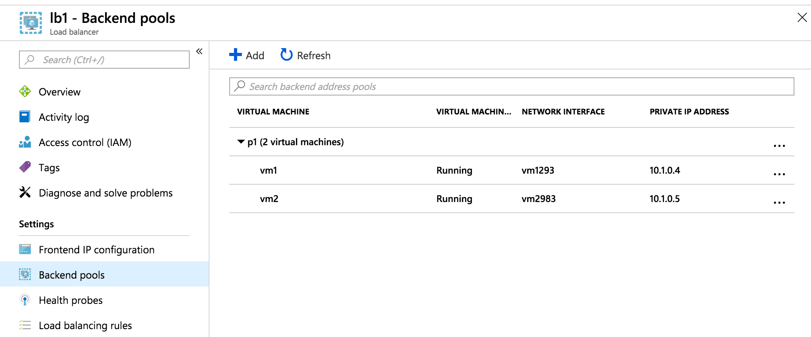
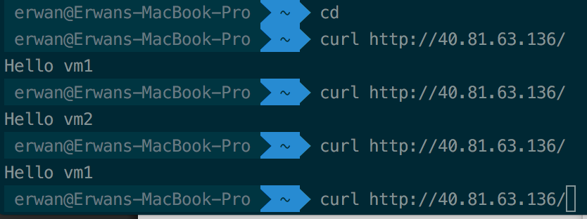

# Azure - Basics - Lab

This lab is part of the [foundations training](https://github.com/ealliaume/foundations) at [OCTO Technology Australia](http://careers.octo.com.au/).

## Overview of this lab

In this quick lab, we will play with the Azure.

At the end of the lab you will be able to:
- Host a **static website** on Azure
- Create **Load Balanced VMs**

This lab should take approximately 45 minutes.
You will need to use your own azure cloud account.

## The Lab - step by step

### 1. Create an Azure Resource Group

Resource groups in Azure is an approach to group a collection of assets in logical groups.
One benefit of using RGs in Azure is grouping related resources that belong to an application together, as they share a unified lifecycle from creation to usage and finally, de-provisioning.

* Create an Azure Resource Group for this lab (Azure Console Menu > Resources Group > Add)
  * Name: azure-lab
  * Subscription: Pay-As-You-Go
  * Resource Group Location: Australia Southeast

### 2. Host a static website using Azure Blob Storage

Azure Storage could be compared to AWS S3 or GCP Cloud Storage in a way, but doesn't have the same list of features.
For example, a general-purpose v2 storage account provides access to all of the Azure Storage services: blobs, files, queues, tables, and disks.

* Create an Azure Storage Account (Azure Console Menu > Storage accounts > Add)
  * Select the "azure-lab" Resource Group we just created
  * Name: pick something unique like 'ealliaumeazurelab'
  * Location: Australia Southeast
  * Account Kind: Storage V2
  * Replication: Locally-redundant storage
  * Access tier: Hot

* Create a Blob Container for your Storage Account
  * Click on the Storage Account you just created, then on "Blobs" menu item
  * Click on "+ Container" to create a new container and "testblobs" and set the **Public Access Level** to **"Container"**

* Upload a simple HTML page to this container
  * Create a simple "index.html" page on your local system, or upload this one from this repo (TODO)
  * Click on the blob container you just created, then "Upload" and select your index.html file

* Now your file is uploaded, you should be able to see it publically from any browser
  * Click on the file you just uploaded
  * Copy/Paste the URL then put is on a new Incognito window of you browser
  * Notice the pattern of the file https://&lt;YourStorageAccount>.blob.core.windows.net/&lt;YourBlobContainer>/index.html

If you try to remove the "index.html" from the URL, a ResourceNotFound error will be display. So far we gave the public access to the file and container, but the container doesn't know how which file you want to expose.

* Enable **static website option** for your container
  * Go back to the Overview of you Storage Account
  * In the sub menu, click on **Static Website**
  * Enable the feature, put "index.html" in the Index Document Name field, then copy the primary endpoint and open it in your browser... FLOP! It is not working... When using the web site hosting feature, Azure is creating a new "$web" blob container for you, you can't use an existing one, so let's fix that.
  * Go the this new **$web** blob container created, upload you index.html file in it and then now it is working :)

### 2. Create Load Balanced VMs

Load balancing provides a higher level of availability and scale by spreading incoming requests across multiple virtual machines (VMs).

#### Create the Load Balancer

Azure Load Balancer is available in two SKUs: Basic and Standard.
Not clear enough? I do Agree.

**Standard Load Balancer** enables you to scale your applications and create high availability for small scale deployments to large and complex multi-zone architectures.
But so does the Basic one :)

The [documentation says](https://docs.microsoft.com/en-us/azure/load-balancer/load-balancer-standard-overview): "New designs should adopt Standard Load Balancer". So let's create a standard one.

There are differences in scale, features, and pricing.

* Create a Basic Load Balancer (Azure Menu > Load Balancer), then **+ Add**
  * Give it a name: lb1
  * Type: Public
  * SKU: Standard
  * Create a NEW IP Address and give it a name "lb1-ip"
  * Availability Zone, you can only choose "Zone-redundant" for this SKU
  * Select the "azure-lab" resource group we created during the step 1
  * And click "Create"

#### Create a Virtual Network

Next step is to create a **Virtual Network**.

Azure Virtual Network enables Virtual Machines (VM) to securely communicate with each other.
It is the equivalent of AWS VPC.

* Create a new  **Virtual Network**. (Azure Menu > Virtual Network), then **+ Add**
  * Give it a name: lb-network
  * Keep the default Address space: 10.1.0.0/16
  * Link in to the Resource Group "azure-lab"

#### Create a Virtual Machines

Create 2 instances or more, we will use them to create a **backend address pool** for the load balancer.

* Create VMs (Azure Menu > Virtual machines), then **+ Add**
  * Link it to the Resource Group "azure-lab"
  * Name: vm1
  * Image: CentOS 7.5
  * Size: B1ms
  * Username: octo
  * Ssh key: copy paste the content of your public key: ~/.ssh/id_rsa.pub
  * Inbound port rules: HTTP, SSH
  * Disk: Standard SSD
  * Network: choose the Virtual Network we just created
  * Then Create the Instance

* Install a web server on it
  * Click on connect to the instance
  * Switch as root: sudo -s
  * Install httpd: yum install httpd
  * Start the service: service httpd start
  * Create a index.html page: echo "Hello $HOSTNAME" > /var/www/html/index.html
  * Check everything is working by access http://&lt;Vm1IPAddress>/

* Dissociate the Basic Public IP for the instance to be usable within a LB
  * Azure Console > All Services > Public IP Addresses
  * Dissociate Option on the rigth or the vm1-ip address

* Create and configure a 2nd instance "vm2" exactly the same way

#### Create a Backend Pool

To distribute traffic to the VMs, a backend pool contains the IP addresses of the VMs.
Let's create a backend pool with our 2 VMs vm1 and vm2.

* Create the **Backend Pool**
  * Go back to your Load Balancer, click on it, then **Backend pools**
  * Click **+ Add**
  * Give it a name: lb1-pool1
  * Select the virtual network and the 2 VMs we just created

If the Virtual Network is not public, it is probably because you asign a "Basic IP Address" instead a "Standard IP Address".

* Create an **Health Probe**
  * Name: port80
  * Protocol: TCP
  * Port: 80
  * Interval: 5 secondes
  * Unhealthly threshold: 2 consecutives failures

* Add a **Load Balancing Rule**
  * All by default, session persistance: None

## Success!!!

Be sure to delete all resources used!

